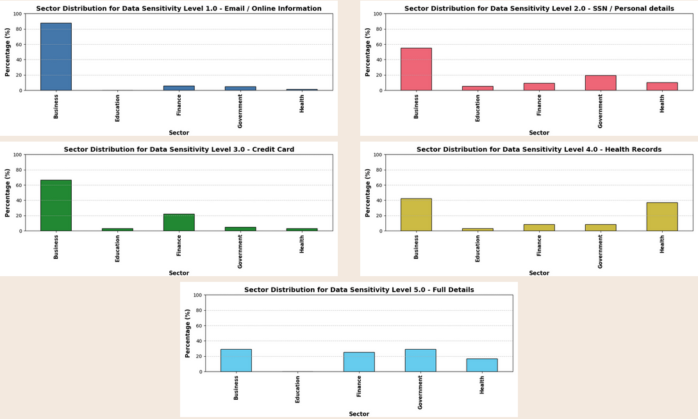

# Content

## Motivation

Nowadays in an age where everything - from health insurance information to university registration - is being digitalized, its hard to not 
come across one so common occurance: data breaches. With over 350M records exposed in the US alone in 2023, data breaches pose a large threat both to the individuals as well as the organizations affected. However, while the occurance is ubiquitous, reporting often overfocuses on the scale rather than the quality of the data exposed, and seems to mostly disregard the interplay with other factors such as industry-specific risks that are specifically of interest to those with executive power.

## Introduction:
More specifically, this project is supposed to showcase the results of our discussion of the question:
**'What personal information is most commonly exposed during data breaches, and how does this exposure vary across different industries?'** as part of the programming project: data science in python and R at the SoSe 25 at TU-Berlin.

## Data
Our analysis of the 4 hypothesis that make up our question is **based on 2 complementary datasets**:
a local, detailed and well structured dataset from the **washington attorney generals office**
and a broader, less detailed one compiled by volunteers given by the **David McCandless Dataset** that
we used to verify trends and draw comparisons.

Most of our analysis use the sector of the **breached organization as an independent variable** for both datasets.
The further dependent variables do differ however:
- In the attorney generals' dataset, we draw conclusions from the **type of personal information exposed** as well as the **affected number of individuals**
- And in the global dataset, we use **data sensitivity**, **the number of records lost** as well as the **method used for the breach**

## Hypothesis:
Here is an overview of the hypothesis, in order:

**Hypothesis 1**: 'The relationship between industry sector and exposed data follows clear, identifiable patterns.' 

**Hypothesis 2**: 'Certain industries tend to expose specific types of data'

**Hypothesis 3**: 'Breach size varies by industry, with some sectors facing consistently larger incidents.'

**Hypothesis 4**: 'The sector and number of records lost can help predict the breach method.'

The results of the analysis in all cases is yielded by the appropriate visualizations which can then be independently analysed by a sufficiently 
competent user. In the following, you will find a guide to set up this repo for yourself:

# Setup
## Project Overview
As a quick glance at the project will reveal, all visualization has been performed using python and standard data-science libraries like pandas and matplotlib, among others. It is organized by hypothesis which, as with the data-preprocessing script, all bear their own sub-directory. 
The outputs can then be found in a subdirectory of each hypothesis.

## Project Structure

## 📁 Data Directory
```
data/
├── 📄 Datasets_Cleaning.py          # Data preprocessing and cleaning utilities
├── 📊 Kaggle_DB_updated.csv         # Updated Kaggle database dataset
├── 📊 Kaggle_DB.csv                 # Original Kaggle database dataset
└── 📊 Washington_DB.csv             # Washington database dataset
```
*Contains raw and processed datasets along with cleaning scripts*

## 🧪 Hypothesis Testing Modules

### Hypothesis 1
```
Hypothesis1/
├── 📊 Hypothesis1_Plots/            # Generated plots and visualizations
└── 📄 Hypothesis1.py                # Main analysis script
```

### Hypothesis 2
```
Hypothesis2/
├── 📊 Hypothesis2_Plots/            # Generated plots and visualizations
├── 📄 DataExposure.py               # Data exposure analysis
└── 📄 ExposureIndustry.py           # Industry-specific exposure analysis
```

### Hypothesis 3
```
Hypothesis3/
├── 📊 Hypothesis3_Plots/            # Generated plots and visualizations
├── 📄 kaggle.py                     # Kaggle data analysis
└── 📄 WA.py                         # Washington data analysis
```

### Hypothesis 4
```
Hypothesis4/
├── 📊 Hypothesis4_Plots/            # Generated plots and visualizations
├── 📄 DecisionTree.py               # Decision tree implementation
└── 📄 Visualization.py              # Data visualization utilities
```

## 🛠️ Environment & Configuration
```
venv/                            # Python virtual environment
.gitignore                       # Git ignore rules
generate_all_plots.py            # Batch plot generation script
```

## 📚 Documentation
```
📄 README.md                         # Project documentation
📄 requirements.txt                  # Python dependencies
```

## Setting up the environment

Its **strongly** recommended to set-up this project through a python virtual environment (conda or uv is obviously fine as well, though we won't include intructions for that here). This especially prevents issues with the version control of certain libraries between projects.

In order to run this, you will need Python 3.7 and upwards installed. If you don't have that, there are numerous instructions on how to install the most popular programming language in your operating system online.

To set up a new virtual environment, you can simply move into the project directory in the command line and run

` python3 -m venv ./venv`

Now, to activate the environment (you will have to always do this in the terminal after initializing a new session to run the scripts) simply run (in the same directory) the command 

`source ./venv/bin/activate`

in your linux operating system of choice. For other operating systems, please refer to other ressources to accomplish the same goal.

Now, since our project does rely on some dependencies in the form of python libraries, you can install those to then seemlessly use without further adjustments by running (inside the activated environment):

`pip3 install -r requirements.txt`

# How-to run
Note that this project does not come with all the visualizations pre-generated (as they are blocked from versioning by git in the .gitignore by their subdirectory). Thus, if you want to generate them all and then view them in the aforementioned subdirectories and after the previous setup, you can run

`python3 generate_all_plots.py`

in the main directory to automatically generate all files from the command line.

However, it is also possible to only generate plots associated with one of the sub-analysis in any given hypothesis. To do that for a given hypothesis, you can just run 

`python3 /HypothesisName/file_name.py`

which will then also interactively visualize the results in a seperate window as they are generated.

## Data preprocessing

You will note that we already have the (generally preprocessed) data from the global dataset included here, which is referenced in its updated form in all applicable scripts. However, in order to understand the cleanup from the non-tidy original file, you can refer to the 
`/data/Datasets_Cleaning.py` 
script for more information.


# Results
After running the visualizations for the different hypothesis, here is what you should roughly expect:

## Hypothesis 1
Hypothesis 1 analyzed the data sensitivity across sectors. The main result of this section is given  
by these individual plots:

As you can see, the distribution of data sensitivity by sector follows a clear path, with e.g. health records being most often exposed in business and health-sector related organizations. On the other hand, sectors such as education seem to have a larger prevalence in medium-sensitivity prevalence while not being likely to expose very sensitive information.
## Hypothesis 2
In hypothesis 2, we had a closer look at the prevalence that certain details are exposed with. In the main finding, we found that common details such as name, social security number and date of birth are most often exposed, while dedicated security-related details such as email- and password logins are one of the least exposed data information types.

## Hypothesis 3
Hypothesis 3 was all about the total-number of breaches-items (measured in both actual number of breaches and affected individuals) relating to the sector. Two of the most important results can be seen here: 

As you can probably tell, the total number of breaches is by far highest in business-organizations. However, looking at the number of people affected, we can see health organizations even slightly surpassing the business figure. This indicates that while businesses are more common and more likely to leak information, health information leaks are, though less common, larger in scale when they do occur.
## Hypothesis 4
Moving on to the final hypothesis, we firstly have a similar statistic, however now relating specifically to the method used for breaches:

As we can see, being hacked is not only the most common reason for a data breach, but also the one most devastating. Thus, organizations are most likely to be exposed to hacking in most of all cases. However, taking this method out of the equation, we are left with less clear of an analysis. This motivates our final visualization given by a decision tree that allows you to gauge the personal risk profile for the most likely exposure methods given three simply assessible features:


## Conclusion & Discussion
So, in conclusion, exposure to data breaches is far from random. In fact, there appear to be specific trends tying escpecially certain sector clusters to to certain types and sensitivity levels of data involved. Furthermore, data breaches seem to be roughly uniform accross country borders, as the same trends observed in the local datasets are also prevalent in the global one. Furthermore, its very possible to access individual risk levels to certain exposure methods by the very simple heuristic provided, which we encourage key decision makers to use and expand on. Targeted awereness and security audits, while maybe seeming like redundant compliance-bs, do serve an important use case in practice and should be taken advantage of regularly. 

However, this obviously does not encompass a complete overview of the trends that can be observed regarding this subject. There is still a lack of data from the attacker perspective as well as scope differences between local and global datasets available. 

If you have any further questions, suggestions or want to contribute, write me a message or create an issue :)